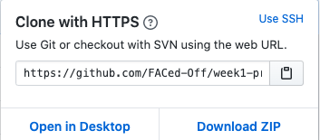

# Team Mango
## Installation
1. Select `week1-project-mango`
2. Copy the “HTTPS clone URL” link using the clipboard icon at the bottom right of the page’s side-bar, pictured below.

3. In the terminal from the home directory, use the command git clone, then paste the link from your clipboard, or copy the command and link: `git clone https://github.com/FACed-Off/week1-project-mango.git`
4. Change directories to the new `~/week1-project-mango` directory: `cd ~/week1-project-mango/`
5. To ensure that the master branch is up-to-date, use the pull command:`git pull https://github.com/FACed-Off/week1-project-mango.git master
`
## Process
### Why
Because we had a burning desire to create a fake agency website! :boom:
### What
This is an agency website for web deveolopers
### How
We triple programmed.

## Team
### What we do?
Web dev agency
### What can we offer you?
Incredible web development solutions!
### Who we are?
Meeran, Shivani and Terrence
### Tell us about you and let us tell you about us!
Visit our [website](https://faced-off.github.io/week1-project-mango/) to get in contact with us and to experience our world-class web design skills!

## Support
Reach out to me at one of the following places!
* shivani@isamazing.com
* terrance@isawesome.com
* meeran@isastonishing.com

Please don't actually reach us on these links. They don't exist! :stuck_out_tongue_winking_eye:	

## Licence
Copyright 2020 © MangoProductions.
